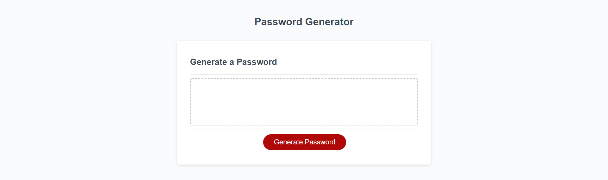
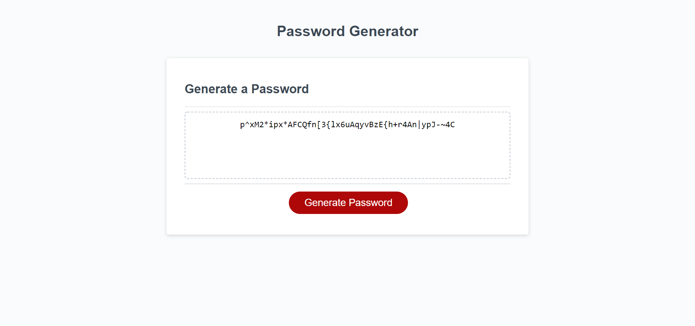

# Password-Generator.

## Project Description

This project was an assignment given that asked us to put the finishing corrections on an established starter code of the HTML file and the CSS starter sheets.  Aside from a few functions listed in our Javascript page, we were to build out the necessary parameters to all the generator to propogate a random password based on a set of information provided by the user.  

## Installation

Use any bowser to visit https://mcnultyshane.github.io/password_generator/ in order to view the project.

## Usage

When visiting the website you will see a large red button that operates our password generator.  Upon clicking the button the user is prompted by the window to set the necessary parameters for the code to generate properly.  Once the prompts are finished, a random code is generated in the white field box for the user to copy.  

## Credits
Penn Coding Bootcamp provided starter code for project with HTML and CSS sheets.

## License
Non-applicable.

## Badges
Non-applicable.

## Features
Non-applicable.

## How to Contribute
Non-applicable.

## Tests
Non-applicable.